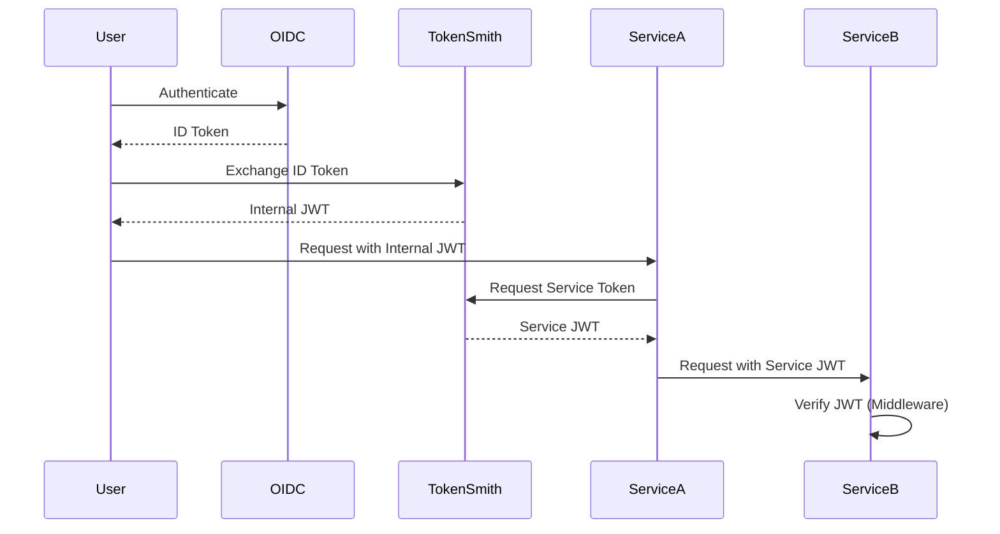

<!--
Copyright © 2025 OpenCHAMI a Series of LF Projects, LLC

SPDX-License-Identifier: MIT
-->

# TokenSmith

TokenSmith bridges external OIDC user identity with internal identity and access management using signed JWTs. It provides internal service-to-service identity and access management, along with a standalone chi middleware for JWT verification using PKI.

## Badges
[](https://api.reuse.software/info/github.com/OpenCHAMI/tokensmith)
[](https://github.com/OpenCHAMI/tokensmith/actions/workflows/Release.yaml)
[](https://github.com/OpenCHAMI/tokensmith/releases)
[](https://pkg.go.dev/github.com/OpenCHAMI/tokensmith)
[](https://goreportcard.com/report/github.com/OpenCHAMI/tokensmith)
[](https://codecov.io/gh/OpenCHAMI/tokensmith)
[](https://securityscorecards.dev/viewer/?uri=github.com/OpenCHAMI/tokensmith)


## Token Flow



## Features

- **Pluggable Policy Engine System**
  - **Static Policy Engine**: Simple hardcoded policy engine with configurable scopes, audiences, and permissions
  - **File-Based Policy Engine**: Dynamic policy engine with role-based access control (RBAC) from JSON configuration
  - **Extensible Architecture**: Easy to implement custom policy engines for complex authorization scenarios
  - **Hot Configuration Reloading**: File-based policy engine supports configuration updates without service restart
  - **Role-Based Access Control**: Support for user and group role mappings with fine-grained permissions

- **Identity Bridging**
  - Exchange external OIDC tokens for internal JWTs
  - Map external identities to internal service identities
  - Dynamic authorization and scope management via policy engines
  - Support for multiple OIDC providers (Keycloak, Hydra, Authelia)

- **Service-to-Service Authentication**
  - Secure internal service communication
  - PKI-based JWT signing and verification
  - Service-specific claims and scopes
  - Automatic token validation

- **JWT Middleware**
  - Standalone chi middleware for JWT verification
  - PKI-based signature validation
  - Support for RSA key pairs and JWKS
  - Scope-based authorization
  - Service-to-service authentication
  - Extensible claims handling

- **OIDC Provider Support**
  - Keycloak integration
  - Hydra integration
  - Authelia integration
  - Extensible provider interface

## Policy Engines

TokenSmith uses a pluggable policy engine system to determine scopes, audiences, and permissions for access tokens. This allows for flexible authorization policies that can be adapted to different use cases.

### Static Policy Engine

The static policy engine provides a simple, hardcoded approach to policy decisions. It's ideal for simple deployments or as a fallback when dynamic policies aren't needed.

**Features:**

- Fixed scopes, audiences, and permissions
- Configurable token lifetime
- Additional custom claims support
- Zero configuration overhead

**Usage:**

```bash
tokensmith serve --policy-engine static --provider hydra
```

### File-Based Policy Engine

The file-based policy engine provides dynamic, role-based access control (RBAC) through JSON configuration files. It supports complex authorization scenarios with user and group role mappings.

**Features:**

- Role-based access control (RBAC)
- User and group role mappings
- Fine-grained permissions per role
- Hot configuration reloading
- Default policy fallback

**Usage:**

```bash
# Generate a policy configuration file
tokensmith generate-policy-config --policy-config policy.json

# Run with file-based policy engine
tokensmith serve --policy-engine file-based --policy-config policy.json --provider hydra
```

**Policy Configuration Example:**

```json
{
  "version": "1.0.0",
  "default_policy": {
    "scopes": ["read"],
    "audiences": ["smd", "bss", "cloud-init"],
    "permissions": ["read:basic"]
  },
  "roles": {
    "admin": {
      "name": "Administrator",
      "description": "Full administrative access",
      "scopes": ["read", "write", "admin"],
      "audiences": ["smd", "bss", "cloud-init", "admin-service"],
      "permissions": ["read:all", "write:all", "admin:all"]
    },
    "user": {
      "name": "Regular User",
      "description": "Basic user access",
      "scopes": ["read"],
      "audiences": ["smd", "bss", "cloud-init"],
      "permissions": ["read:basic"]
    }
  },
  "user_role_mappings": {
    "adminuser": ["admin"],
    "regularuser": ["user"]
  },
  "group_role_mappings": {
    "admins": ["admin"],
    "users": ["user"]
  }
}
```

### Custom Policy Engines

You can implement custom policy engines by implementing the `policy.Engine` interface:

```go
type Engine interface {
    EvaluatePolicy(ctx context.Context, policyCtx *PolicyContext) (*PolicyDecision, error)
    GetName() string
    GetVersion() string
    ValidateConfiguration() error
}
```

See the [policy package documentation](pkg/policy/README.md) for detailed implementation examples.

## Container Deployment

TokenSmith can be deployed using Docker. The following environment variables can be used to configure the service:

### Required Environment Variables

| Environment Variable | Description | Default |
|---------------------|-------------|---------|
| `TOKENSMITH_ISSUER` | The issuer URL for the token service | `https://tokensmith.openchami.dev` |
| `TOKENSMITH_CLUSTER_ID` | The ID of the cluster | `default-cluster` |
| `TOKENSMITH_OPENCHAMI_ID` | The ID of the OpenCHAMI instance | `default-openchami` |
| `TOKENSMITH_CONFIG` | Path to the configuration file | `/tokensmith/config.json` |
| `TOKENSMITH_KEY_DIR` | Directory for storing JWT keys | `/tokensmith/keys` |
| `TOKENSMITH_OIDC_PROVIDER` | OIDC provider type (hydra, keycloak, authelia) | `hydra` |
| `TOKENSMITH_PORT` | HTTP server port | `8080` |

### OIDC Provider Credentials

Depending on your chosen OIDC provider, you'll need to set the following credentials:

#### Hydra
- `HYDRA_CLIENT_ID` - Client ID for Hydra
- `HYDRA_CLIENT_SECRET` - Client Secret for Hydra

#### Keycloak
- `KEYCLOAK_CLIENT_ID` - Client ID for Keycloak
- `KEYCLOAK_CLIENT_SECRET` - Client Secret for Keycloak

#### Authelia
- `AUTHELIA_CLIENT_ID` - Client ID for Authelia
- `AUTHELIA_CLIENT_SECRET` - Client Secret for Authelia

### Example Docker Run Command

```bash
docker run -d \
  -p 8080:8080 \
  -e TOKENSMITH_ISSUER="https://tokensmith.example.com" \
  -e TOKENSMITH_CLUSTER_ID="my-cluster" \
  -e TOKENSMITH_OPENCHAMI_ID="my-openchami" \
  -e TOKENSMITH_OIDC_PROVIDER="hydra" \
  -e HYDRA_CLIENT_ID="your-client-id" \
  -e HYDRA_CLIENT_SECRET="your-client-secret" \
  -v /path/to/config.json:/tokensmith/config.json \
  -v /path/to/keys:/tokensmith/keys \
  tokensmith:latest
```

### Important Notes

1. The `keys` directory is used to store JWT signing keys. Make sure to:
   - Mount a persistent volume for the keys directory
   - Set appropriate permissions on the host directory
   - Back up the keys directory regularly

2. The configuration file should be mounted from the host system and contain your group scope mappings.  Tokensmith can generate a configuration file to start with: `tokensmith generate-config --config=config.json`

3. For security:
   - Never commit OIDC credentials to version control
   - Use Docker secrets or a secure secrets management system in production

## Project Structure

```
tokensmith/
├── cmd/
│   └── tokensmith/          # Main application entry point
├── pkg/
│   ├── keys/               # Key management utilities
│   ├── oidc/               # OIDC provider implementations
│   │   ├── authelia/       # Authelia provider
│   │   ├── hydra/          # Hydra provider
│   │   ├── keycloak/       # Keycloak provider
│   │   └── provider.go     # Provider interface
│   ├── policy/             # Pluggable policy engine system
│   │   ├── engine.go       # Policy engine interface
│   │   ├── static.go       # Static policy engine
│   │   ├── file_based.go   # File-based policy engine
│   │   └── README.md       # Policy engine documentation
│   ├── token/              # JWT token management
│   ├── tokenservice/       # Token exchange service
│   └── middleware/         # JWT middleware (standalone)
└── example/                # Example applications
    ├── middleware/         # Example of middleware usage
    └── policy/             # Policy engine examples
```

## Local Installation

### Main Service

```bash
go get github.com/openchami/tokensmith
```

### JWT Middleware

```bash
go get github.com/openchami/tokensmith/middleware
```

See the [middleware documentation](middleware/README.md) for detailed usage instructions.

## Usage

### Token Service

The token service can be run as a standalone application. First, generate a default configuration file:

```bash
tokensmith generate-config --config config.json
```

#### Available Commands

- `tokensmith serve` - Start the token service
- `tokensmith generate-config` - Generate a default configuration file
- `tokensmith generate-policy-config` - Generate a default policy configuration file

#### Using Static Policy Engine (Default)

Start the service with the static policy engine:

```bash
tokensmith serve \
  --provider=keycloak \
  --issuer=http://tokensmith:8080 \
  --port=8080 \
  --cluster-id=test-cluster-id \
  --openchami-id=test-openchami-id \
  --config=config.json \
  --policy-engine=static
```

#### Using File-Based Policy Engine

Generate a policy configuration file and start the service:

```bash
# Generate a policy configuration file
tokensmith generate-policy-config --policy-config policy.json

# Start the service with file-based policy engine
tokensmith serve \
  --provider=keycloak \
  --issuer=http://tokensmith:8080 \
  --port=8080 \
  --cluster-id=test-cluster-id \
  --openchami-id=test-openchami-id \
  --config=config.json \
  --policy-engine=file-based \
  --policy-config=policy.json
```

#### Configuration File

The configuration file (JSON format) contains settings that don't change frequently:

```json
{
  "groupScopes": {
    "admin": ["admin", "write", "read"],
    "operator": ["write", "read"],
    "viewer": ["read"],
    "user": ["read"]
  }
}
```

Configuration options:

| Flag | Description | Default |
|------|-------------|---------|
| `--provider` | OIDC provider type (keycloak, hydra, authelia) | `hydra` |
| `--issuer` | Token issuer identifier | `http://tokensmith:8080` |
| `--port` | HTTP server port | `8080` |
| `--cluster-id` | Unique identifier for this cluster | `cl-F00F00F00` |
| `--openchami-id` | Unique identifier for this instance of OpenCHAMI | `oc-F00F00F00` |
| `--hydra-url` | Hydra admin API URL | `http://hydra:4445` |
| `--authelia-url` | Authelia admin API URL | `http://authelia:9091` |
| `--keycloak-url` | Keycloak admin API URL | `http://keycloak:8080` |
| `--keycloak-realm` | Keycloak realm | `openchami` |
| `--config` | Path to configuration file | `""` |
| `--policy-engine` | Policy engine type (static, file-based) | `static` |
| `--policy-config` | Path to policy configuration file | `""` |

| Environment Variable | Description |
|------|-------------|
| `HYDRA_CLIENT_ID` | Client ID for hydra |
| `HYDRA_CLIENT_SECRET` | Client Secret for hydra |
| `KEYCLOAK_CLIENT_ID` | Client ID for Keycloak |
| `KEYCLOAK_CLIENT_SECRET` | Client Secret for Keycloak |
| `AUTHELIA_CLIENT_ID` | Client ID for Authelia |
| `AUTHELIA_CLIENT_SECRET` | Client Secret for Authelia |

### JWT Middleware

```bash
go get github.com/openchami/tokensmith/middleware
```

## Development

### Prerequisites

- Go 1.21 or later
- Access to an OIDC provider (Keycloak, Hydra, or Authelia)

### Build & Install
This project uses [GoReleaser](https://goreleaser.com/) to automate releases and embed additional build metadata (commit info, build time, versioning, etc.).

#### 1. Environment Variables
Before building, make sure to set the following environment variables to include detailed build metadata:

- **GIT_STATE**: Indicates whether there are uncommitted changes. (`clean` if no changes, `dirty` if there are.)
- **BUILD_HOST**: Hostname of the machine performing the build.
- **GO_VERSION**: The version of Go used.
- **BUILD_USER**: The username of the person or system performing the build.

Example:
```bash
export GIT_STATE=$(if git diff-index --quiet HEAD --; then echo 'clean'; else echo 'dirty'; fi)
export BUILD_HOST=$(hostname)
export GO_VERSION=$(go version | awk '{print $3}')
export BUILD_USER=$(whoami)
```

#### 2. Installing GoReleaser
Follow the official [GoReleaser installation instructions](https://goreleaser.com/install/) to set up GoReleaser locally.

#### 3. Building Locally with GoReleaser
Use snapshot mode to build locally without releasing:

```bash
goreleaser release --snapshot --clean
```

- The build artifacts (including embedded metadata) will be placed in the `dist/` directory.
- Inspect the resulting binaries to ensure the metadata was correctly embedded.


### Testing

```bash
# Run all tests
go test ./...

# Run specific package tests
go test ./pkg/tokenservice
go test ./pkg/middleware
```

## Contributing

1. Fork the repository
2. Create your feature branch (`git checkout -b feature/amazing-feature`)
3. Commit your changes (`git commit -m 'Add some amazing feature'`)
4. Push to the branch (`git push origin feature/amazing-feature`)
5. Open a Pull Request

See the [OpenCHAMI Contributors Guide](https://github.com/OpenCHAMI/.github/blob/main/CONTRIBUTING.md) for more information.

## License

This project is licensed under the MIT License - see the LICENSE file for details.

## Acknowledgments

- OpenCHAMI community
- OIDC provider maintainers
- Contributors and maintainers of this project


