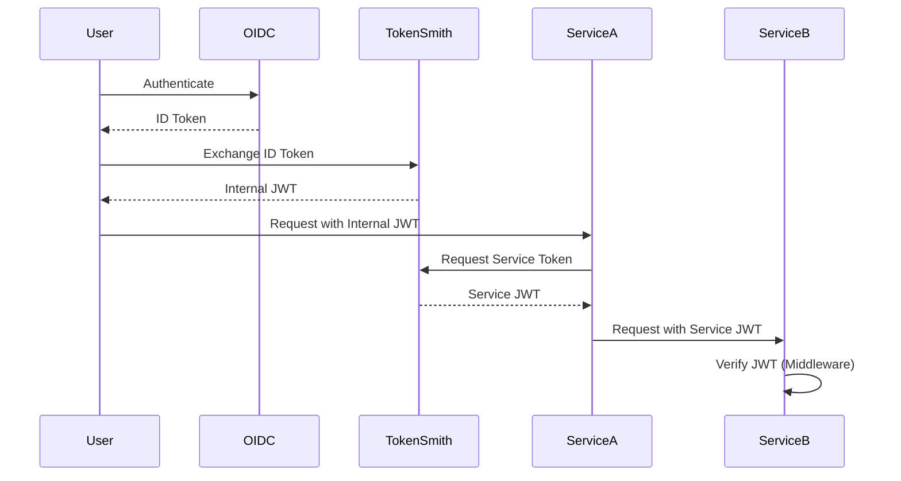

# TokenSmith

TokenSmith bridges external OIDC user identity with internal identity and access management using signed JWTs. It provides internal service-to-service identity and access management, along with a standalone chi middleware for JWT verification using PKI.

## Token Flow



## Features

- **Identity Bridging**
  - Exchange external OIDC tokens for internal JWTs
  - Map external identities to internal service identities
  - Group-based authorization and scope management
  - Support for multiple OIDC providers (Keycloak, Hydra, Authelia)

- **Service-to-Service Authentication**
  - Secure internal service communication
  - PKI-based JWT signing and verification
  - Service-specific claims and scopes
  - Automatic token validation

- **JWT Middleware**
  - Standalone chi middleware for JWT verification
  - PKI-based signature validation
  - Support for RSA key pairs and JWKS
  - Scope-based authorization
  - Service-to-service authentication
  - Extensible claims handling

- **OIDC Provider Support**
  - Keycloak integration
  - Hydra integration
  - Authelia integration
  - Extensible provider interface

## Project Structure

```
tokensmith/
├── cmd/
│   └── tokensmith/          # Main application entry point
├── pkg/
│   ├── jwt/                 # JWT package (shared)
│   │   ├── oidc/           # OIDC provider implementations
│   │   │   ├── authelia/   # Authelia provider
│   │   │   ├── hydra/      # Hydra provider
│   │   │   └── keycloak/   # Keycloak provider
│   │   └── provider.go     # Provider interface
│   ├── tokenservice/       # Token exchange service
│   └── middleware/         # JWT middleware (standalone)
└── example/                # Example applications
    └── middleware/         # Example of middleware usage
```

## Installation

### Main Service

```bash
go get github.com/openchami/tokensmith
```

### JWT Middleware

```bash
go get github.com/openchami/tokensmith/middleware
```

See the [middleware documentation](middleware/README.md) for detailed usage instructions.

## Usage

### Token Service

The token service can be run as a standalone application. First, generate a default configuration file:

```bash
tokensmith generate-config --config config.json
```

Then start the service with the configuration file:

```bash
tokensmith serve \
  --provider=keycloak \
  --issuer=http://tokensmith:8080 \
  --port=8080 \
  --cluster-id=test-cluster-id \
  --openchami-id=test-openchami-id \
  --config=config.json
```

#### Configuration File

The configuration file (JSON format) contains settings that don't change frequently:

```json
{
  "groupScopes": {
    "admin": ["admin", "write", "read"],
    "operator": ["write", "read"],
    "viewer": ["read"],
    "user": ["read"]
  }
}
```

Configuration options:

| Flag | Description | Default |
|------|-------------|---------|
| `--provider` | OIDC provider type (keycloak, hydra, authelia) | `hydra` |
| `--issuer` | Token issuer identifier | `http://tokensmith:8080` |
| `--port` | HTTP server port | `8080` |
| `--cluster-id` | Unique identifier for this cluster | `cl-F00F00F00` |
| `--openchami-id` | Unique identifier for this instance of OpenCHAMI | `oc-F00F00F00` |
| `--hydra-url` | Hydra admin API URL | `http://hydra:4445` |
| `--authelia-url` | Authelia admin API URL | `http://authelia:9091` |
| `--keycloak-url` | Keycloak admin API URL | `http://keycloak:8080` |
| `--keycloak-realm` | Keycloak realm | `openchami` |
| `--config` | Path to configuration file | `""` |

| Environment Variable | Description |
|------|-------------|
| `HYDRA_CLIENT_ID` | Client ID for hydra |
| `HYDRA_CLIENT_SECRET` | Client Secret for hydra |
| `KEYCLOAK_CLIENT_ID` | Client ID for Keycloak |
| `KEYCLOAK_CLIENT_SECRET` | Client Secret for Keycloak |
| `AUTHELIA_CLIENT_ID` | Client ID for Authelia |
| `AUTHELIA_CLIENT_SECRET` | Client Secret for Authelia |

### JWT Middleware

```bash
go get github.com/openchami/tokensmith/middleware
```

## Development

### Prerequisites

- Go 1.21 or later
- Access to an OIDC provider (Keycloak, Hydra, or Authelia)

### Build & Install
This project uses [GoReleaser](https://goreleaser.com/) to automate releases and embed additional build metadata (commit info, build time, versioning, etc.).

#### 1. Environment Variables
Before building, make sure to set the following environment variables to include detailed build metadata:

- **GIT_STATE**: Indicates whether there are uncommitted changes. (`clean` if no changes, `dirty` if there are.)
- **BUILD_HOST**: Hostname of the machine performing the build.
- **GO_VERSION**: The version of Go used.
- **BUILD_USER**: The username of the person or system performing the build.

Example:
```bash
export GIT_STATE=$(if git diff-index --quiet HEAD --; then echo 'clean'; else echo 'dirty'; fi)
export BUILD_HOST=$(hostname)
export GO_VERSION=$(go version | awk '{print $3}')
export BUILD_USER=$(whoami)
```

#### 2. Installing GoReleaser
Follow the official [GoReleaser installation instructions](https://goreleaser.com/install/) to set up GoReleaser locally.

#### 3. Building Locally with GoReleaser
Use snapshot mode to build locally without releasing:

```bash
goreleaser release --snapshot --clean
```

- The build artifacts (including embedded metadata) will be placed in the `dist/` directory.
- Inspect the resulting binaries to ensure the metadata was correctly embedded.


### Testing

```bash
# Run all tests
go test ./...

# Run specific package tests
go test ./pkg/tokenservice
go test ./pkg/middleware
```

## Contributing

1. Fork the repository
2. Create your feature branch (`git checkout -b feature/amazing-feature`)
3. Commit your changes (`git commit -m 'Add some amazing feature'`)
4. Push to the branch (`git push origin feature/amazing-feature`)
5. Open a Pull Request

See the [OpenCHAMI Contributors Guide](https://github.com/OpenCHAMI/.github/blob/main/CONTRIBUTING.md) for more information.

## License

This project is licensed under the MIT License - see the LICENSE file for details.

## Acknowledgments

- OpenCHAMI community
- OIDC provider maintainers
- Contributors and maintainers of this project 