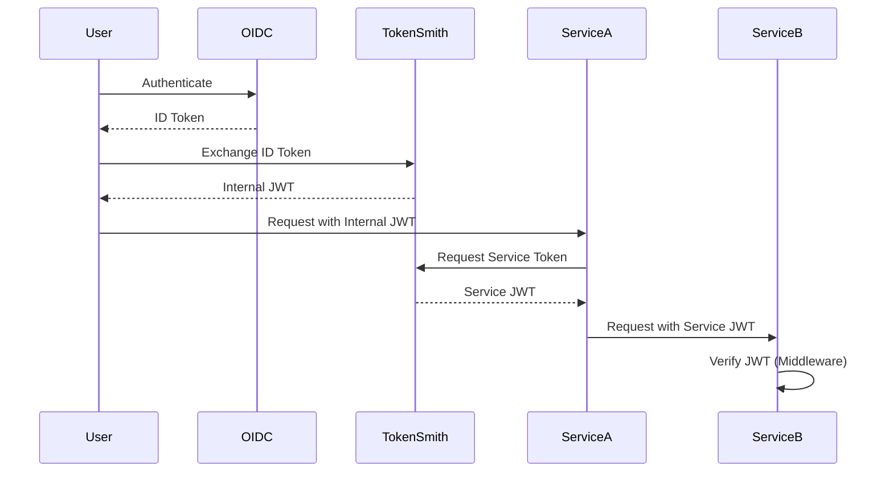

<!--
Copyright © 2025 OpenCHAMI a Series of LF Projects, LLC

SPDX-License-Identifier: MIT
BLAH
-->

# TokenSmith

TokenSmith bridges external OIDC user identity with internal identity and access management using signed JWTs. It provides internal service-to-service identity and access management, along with a standalone chi middleware for JWT verification using PKI.

## Badges
[](https://api.reuse.software/info/github.com/OpenCHAMI/tokensmith)[](https://github.com/OpenCHAMI/tokensmith/actions/workflows/golangci-lint.yaml)
[](https://github.com/OpenCHAMI/tokensmith/actions/workflows/Release.yaml)
[](https://github.com/OpenCHAMI/tokensmith/releases)
[](https://pkg.go.dev/github.com/OpenCHAMI/tokensmith)
[](https://goreportcard.com/report/github.com/OpenCHAMI/tokensmith)
[](https://securityscorecards.dev/viewer/?uri=github.com/OpenCHAMI/tokensmith)


## Token Flow


```mermaid
sequenceDiagram
    participant User
    participant OIDC
    participant TokenSmith
    participant ServiceA
    participant ServiceB

    %% User Authentication Flow
    User->>OIDC: Authenticate
    OIDC-->>User: ID Token
    User->>TokenSmith: Exchange ID Token
    TokenSmith-->>User: Internal JWT
    User->>ServiceA: Request with Internal JWT

    %% Service-to-Service Flow
    ServiceA->>TokenSmith: Request Service Token
    TokenSmith-->>ServiceA: Service JWT
    ServiceA->>ServiceB: Request with Service JWT
    ServiceB->>ServiceB: Verify JWT (Middleware)
```

## Features

- **Identity Bridging**
  - Exchange external OIDC tokens for internal JWTs
  - Map external identities to internal service identities
  - Dynamic authorization and scope management via policy engines
  - Support for multiple OIDC providers (Keycloak, Hydra, Authelia)

- **Service-to-Service Authentication**
  - Secure internal service communication
  - PKI-based JWT signing and verification
  - Service-specific claims and scopes
  - Automatic token validation

- **JWT Middleware**
  - Standalone chi middleware for JWT verification
  - PKI-based signature validation
  - Support for RSA key pairs and JWKS
  - Scope-based authorization
  - Service-to-service authentication
  - Extensible claims handling
  - Casbin intergration for policy-based authorization

- **OIDC Provider Support**
  - Keycloak integration
  - Hydra integration
  - Authelia integration
  - Extensible provider interface

- **Policy-based Authorization (Casbin)**
  - File-backed Casbin enforcer with optional auto-reload
  - Fail-fast and permissive fallbacks for operational resilience
  - Pluggable subject/object/action mappers for flexible JWT shapes

## Container Deployment

TokenSmith can be deployed using Docker. The following environment variables can be used to configure the service:

### Required Environment Variables

| Environment Variable | Description | Default |
|---------------------|-------------|---------|
| `TOKENSMITH_ISSUER` | The issuer URL for the token service | `https://tokensmith.openchami.dev` |
| `TOKENSMITH_CLUSTER_ID` | The ID of the cluster | `default-cluster` |
| `TOKENSMITH_OPENCHAMI_ID` | The ID of the OpenCHAMI instance | `default-openchami` |
| `TOKENSMITH_CONFIG` | Path to the configuration file | `/tokensmith/config.json` |
| `TOKENSMITH_KEY_DIR` | Directory for storing JWT keys | `/tokensmith/keys` |
| `TOKENSMITH_OIDC_PROVIDER` | OIDC provider type (hydra, keycloak, authelia) | `hydra` |
| `TOKENSMITH_PORT` | HTTP server port | `8080` |

### OIDC Provider Credentials

Depending on your chosen OIDC provider, you'll need to set the following credentials:

#### Hydra
- `HYDRA_CLIENT_ID` - Client ID for Hydra
- `HYDRA_CLIENT_SECRET` - Client Secret for Hydra

#### Keycloak
- `KEYCLOAK_CLIENT_ID` - Client ID for Keycloak
- `KEYCLOAK_CLIENT_SECRET` - Client Secret for Keycloak

#### Authelia
- `AUTHELIA_CLIENT_ID` - Client ID for Authelia
- `AUTHELIA_CLIENT_SECRET` - Client Secret for Authelia

### Example Docker Run Command

```bash
docker run -d \
  -p 8080:8080 \
  -e TOKENSMITH_ISSUER="https://tokensmith.example.com" \
  -e TOKENSMITH_CLUSTER_ID="my-cluster" \
  -e TOKENSMITH_OPENCHAMI_ID="my-openchami" \
  -e TOKENSMITH_OIDC_PROVIDER="hydra" \
  -e HYDRA_CLIENT_ID="your-client-id" \
  -e HYDRA_CLIENT_SECRET="your-client-secret" \
  -v /path/to/config.json:/tokensmith/config.json \
  -v /path/to/keys:/tokensmith/keys \
  tokensmith:latest
```

### Important Notes

1. The `keys` directory is used to store JWT signing keys. Make sure to:
   - Mount a persistent volume for the keys directory
   - Set appropriate permissions on the host directory
   - Back up the keys directory regularly

2. The configuration file should be mounted from the host system and contain your group scope mappings.  Tokensmith can generate a configuration file to start with: `tokensmith generate-config --config=config.json`

3. For security:
   - Never commit OIDC credentials to version control
   - Use Docker secrets or a secure secrets management system in production

## Project Structure

```
tokensmith/
├── cmd/
│   └── tokensmith/          # Main application entry point
├── pkg/
│   ├── keys/               # Key management utilities
│   ├── oidc/               # OIDC provider implementations
│   │   ├── authelia/       # Authelia provider
│   │   ├── hydra/          # Hydra provider
│   │   ├── keycloak/       # Keycloak provider
│   │   └── provider.go     # Provider interface
│   ├── policy/             # Pluggable policy engine system
│   │   ├── engine.go       # Policy engine interface
│   │   ├── static.go       # Static policy engine
│   │   ├── file_based.go   # File-based policy engine
│   │   └── README.md       # Policy engine documentation
│   ├── token/              # JWT token management
│   ├── tokenservice/       # Token exchange service
│   └── middleware/         # JWT middleware (standalone)
└── example/                # Example applications
    ├── middleware/         # Example of middleware usage
    └── policy/             # Policy engine examples
```

## Local Installation

### Main Service

```bash
go get github.com/openchami/tokensmith
```

### JWT Middleware

```bash
go get github.com/openchami/tokensmith/middleware
```

See the [middleware documentation](middleware/README.md) for detailed usage instructions.

## Usage

### Token Service

The token service can be run as a standalone application. First, generate a default configuration file:

```bash
tokensmith generate-config --config config.json
```

#### Available Commands

- `tokensmith serve` - Start the token service
- `tokensmith generate-config` - Generate a default configuration file

#### Configuration File

The configuration file (JSON format) contains settings that don't change frequently:

```json
{
  "groupScopes": {
    "admin": ["admin", "write", "read"],
    "operator": ["write", "read"],
    "viewer": ["read"],
    "user": ["read"]
  }
}
```

Configuration options:

| Flag | Description | Default |
|------|-------------|---------|
| `--provider` | OIDC provider type (keycloak, hydra, authelia) | `hydra` |
| `--issuer` | Token issuer identifier | `http://tokensmith:8080` |
| `--port` | HTTP server port | `8080` |
| `--cluster-id` | Unique identifier for this cluster | `cl-F00F00F00` |
| `--openchami-id` | Unique identifier for this instance of OpenCHAMI | `oc-F00F00F00` |
| `--hydra-url` | Hydra admin API URL | `http://hydra:4445` |
| `--authelia-url` | Authelia admin API URL | `http://authelia:9091` |
| `--keycloak-url` | Keycloak admin API URL | `http://keycloak:8080` |
| `--keycloak-realm` | Keycloak realm | `openchami` |
| `--config` | Path to configuration file | `""` |

| Environment Variable | Description |
|------|-------------|
| `HYDRA_CLIENT_ID` | Client ID for hydra |
| `HYDRA_CLIENT_SECRET` | Client Secret for hydra |
| `KEYCLOAK_CLIENT_ID` | Client ID for Keycloak |
| `KEYCLOAK_CLIENT_SECRET` | Client Secret for Keycloak |
| `AUTHELIA_CLIENT_ID` | Client ID for Authelia |
| `AUTHELIA_CLIENT_SECRET` | Client Secret for Authelia |

### JWT Middleware

```bash
go get github.com/openchami/tokensmith/middleware
```

## Authorization (Casbin)

TokenSmith ships with an opinionated Casbin-based authorization helper to make it easy to enforce fine-grained access control based on JWT claims. The implementation provides a file-backed Casbin enforcer factory, a chi middleware wrapper, and reasonable defaults that fit HPC-style resource management scenarios.

Key environment variables and defaults

- TOKENSMITH_CASBIN_MODEL_PATH (default: ./casbin_model.conf)
- TOKENSMITH_CASBIN_POLICY_PATH (default: ./casbin_policy.csv)
- TOKENSMITH_CASBIN_AUTOLOAD_SECONDS (default: 0, disabled)

These environment variables are consulted by CreateEnforcer when an explicit path is not provided via EnforcerOptions.

CreateEnforcer behavior

The factory function has signature:

- CreateEnforcer(ctx context.Context, opts *EnforcerOptions) (*casbin.Enforcer, error)

EnforcerOptions fields:
- ModelPath, PolicyPath: override the default model/policy file locations
- AutoLoadSeconds: if >0, the enforcer will call StartAutoLoadPolicy with the specified interval
- FailFast: when true (default when opts==nil) CreateEnforcer returns an error if the model or policy cannot be loaded
- Permissive: used only when FailFast is false; if Permissive==true CreateEnforcer returns an enforcer that always allows (useful for degraded/maintenance modes); if Permissive==false CreateEnforcer returns an enforcer that always denies

Operation summary:
- If model/policy load succeeds, the enforcer is returned and AutoLoadSeconds (if set) starts a background reload ticker.
- If load fails and FailFast==true, CreateEnforcer returns an error (recommended for production to avoid silently allowing access).
- If load fails and FailFast==false, CreateEnforcer returns either a permissive (allow-all) or deny-all enforcer depending on Permissive.

Wiring the Authz middleware

The chi middleware wrapper has signature:

- AuthzMiddleware(enforcer *casbin.Enforcer, opts *AuthzOptions) func(http.Handler) http.Handler

AuthzOptions allows you to configure:
- ExemptPaths []string: list of paths to skip authorization checks (supports exact match and prefix match using a trailing "*")
- ContextKey string: context key where JWT claims are stored by the JWT middleware (default: "jwt_claims")
- FailOpen bool: when true, errors returned from enforcer.Enforce() will allow the request instead of denying it (default false)
- SubjectMapper, ObjectMapper, ActionMapper: optional functions to map the request+claims into Casbin subject(s), object and action strings

Example (chi wiring)

```go
import (
    "context"
    "log"
    "net/http"

    "github.com/go-chi/chi/v5"
    "github.com/openchami/tokensmith/middleware"
)

func main() {
    // Create enforcer (reads env vars if paths not provided)
    enf, err := middleware.CreateEnforcer(context.Background(), &middleware.EnforcerOptions{})
    if err != nil {
        log.Fatalf("failed to create enforcer: %v", err)
    }

    r := chi.NewRouter()

    // Ensure your JWT verification middleware runs before the Authz middleware
    // r.Use(JWTVerificationMiddleware)

    r.Use(middleware.AuthzMiddleware(enf, &middleware.AuthzOptions{
        ExemptPaths: []string{"/health", "/metrics*"},
        FailOpen:    false,
    }))

    r.Get("/hpc/jobs/{id}", func(w http.ResponseWriter, r *http.Request) {
        w.Write([]byte("job details"))
    })

    http.ListenAndServe(":8080", r)
}
```

Subject mapping rules

The default SubjectMapper follows this priority (so you do not normally need to provide a custom mapper):
1. If the JWT claims contain a Keycloak-style `realm_access.roles` array, each role becomes `role:<role>` (e.g. `role:admin`).
2. Else, if the JWT contains a top-level `roles` array, each entry becomes `role:<role>`.
3. Else, if claims are of type `*token.TSClaims` the mapper will use `user:<sub>` where `<sub>` is the token subject.
4. Else, if the claims are a generic map and contain a `sub` claim, the mapper falls back to `user:<sub>`.

Examples (JWT payloads -> derived subjects):

- Keycloak-style roles payload
```json
{
  "sub": "alice",
  "realm_access": { "roles": ["admin", "operator"] }
}
```
derived subjects: ["role:admin", "role:operator"]

- Top-level roles array
```json
{
  "sub": "bob",
  "roles": ["user"]
}
```
derived subjects: ["role:user"]

- TSClaims or plain subject fallback
```json
{
  "sub": "carol"
}
```
derived subjects: ["user:carol"]

If your application uses a different JWT shape you may provide a custom SubjectMapper in AuthzOptions. The mapper receives the *http.Request and the raw claims value placed into the request context by the JWT middleware, and must return a list of subject strings that match your Casbin policy subjects (for example: "role:admin" or "user:alice").

Test helpers

The repository includes test-only helpers to make authorization unit tests deterministic:
- middleware/jwt_test_helper_test.go: helpers to create ephemeral signing keys and sign tokens (RS/ECDSA). These helpers live in _test.go files and should only be used from test code.
- middleware/claim_injector_test.go: a test-only middleware that injects arbitrary claims into the request context (useful for testing AuthzMiddleware behavior without signature verification). It is intentionally unsafe and compiled only for tests.

Use these helpers in your service tests to build tokens or inject claims so you can assert allow/deny behavior of the middleware.

Where policies live and how to override

By default TokenSmith looks for the Casbin model and policy files at:
- ./casbin_model.conf
- ./casbin_policy.csv

You can override these locations via environment variables or EnforcerOptions:
- TOKENSMITH_CASBIN_MODEL_PATH -> custom model file
- TOKENSMITH_CASBIN_POLICY_PATH -> custom policy file

Operational notes (hot-reload vs non-hot-reload)

- Hot-reload: set TOKENSMITH_CASBIN_AUTOLOAD_SECONDS (or EnforcerOptions.AutoLoadSeconds) to a positive integer to enable automatic periodic reload of policies from the backing adapter. This allows policy changes on disk to be picked up without restarting services (file adapter is supported). If the auto-load fails to start it will be logged but the enforcer may still operate with the loaded policy.

- Non-hot-reload: use the default (0) if you prefer policy changes to require a service restart. This is simpler and avoids potential runtime race/consistency concerns in distributed environments.

- FailFast vs FailOpen/Permissive: In production we recommend FailFast==true so that an inability to load model/policy results in startup failure rather than silently allowing access. For maintenance or staging you can set FailFast==false and Permissive==true to allow requests while policies are unavailable.

Sample policy snippets (HPC scenarios)

Model and policy files are plain Casbin model and CSV policy. Example policy lines demonstrating HPC semantics:

# allow admins all actions on HPC resources
p, role:admin, /hpc/*, *

# operators can submit jobs and read job lists
p, role:operator, /hpc/jobs, post
p, role:operator, /hpc/jobs, get

# regular users can view their own job details (object matching uses prefix or regex in model)
p, role:user, /hpc/jobs/{id}, get

# a specific user override (user-level exception)
p, user:alice, /hpc/queue/priority, post

# bind users to roles (grouping) - the subject strings must match your SubjectMapper output
g, user:alice, role:operator

These CSV lines are illustrative; your model may use regexMatch or other matchers to support parameterized object matching.

Putting it together: service wiring example

- On service startup, create the enforcer (using env vars or explicit paths) and mount the AuthzMiddleware after your JWT verification middleware.
- Provide custom mappers only if the default subject/object/action derivation doesn't match your JWT shapes or resource model.
- Use TestClaimInjector and jwt_test_helper_test.go in unit tests to exercise authorization logic deterministically.


## Development

### Prerequisites

- Go 1.21 or later
- Access to an OIDC provider (Keycloak, Hydra, or Authelia)

### Build & Install
This project uses [GoReleaser](https://goreleaser.com/) to automate releases and embed additional build metadata (commit info, build time, versioning, etc.).

#### 1. Environment Variables
Before building, make sure to set the following environment variables to include detailed build metadata:

- **GIT_STATE**: Indicates whether there are uncommitted changes. (`clean` if no changes, `dirty` if there are.)
- **BUILD_HOST**: Hostname of the machine performing the build.
- **GO_VERSION**: The version of Go used.
- **BUILD_USER**: The username of the person or system performing the build.

Example:
```bash
export GIT_STATE=$(if git diff-index --quiet HEAD --; then echo 'clean'; else echo 'dirty'; fi)
export BUILD_HOST=$(hostname)
export GO_VERSION=$(go version | awk '{print $3}')
export BUILD_USER=$(whoami)
```

#### 2. Installing GoReleaser
Follow the official [GoReleaser installation instructions](https://goreleaser.com/install/) to set up GoReleaser locally.

#### 3. Building Locally with GoReleaser
Use snapshot mode to build locally without releasing:

```bash
goreleaser release --snapshot --clean
```

- The build artifacts (including embedded metadata) will be placed in the `dist/` directory.
- Inspect the resulting binaries to ensure the metadata was correctly embedded.


### Testing

```bash
# Run all tests
go test ./...

# Run specific package tests
go test ./pkg/tokenservice
go test ./pkg/middleware
```

## Contributing

1. Fork the repository
2. Create your feature branch (`git checkout -b feature/amazing-feature`)
3. Commit your changes (`git commit -m 'Add some amazing feature'`)
4. Push to the branch (`git push origin feature/amazing-feature`)
5. Open a Pull Request

See the [OpenCHAMI Contributors Guide](https://github.com/OpenCHAMI/.github/blob/main/CONTRIBUTING.md) for more information.

## License

This project is licensed under the MIT License - see the LICENSE file for details.

## Acknowledgments

- OpenCHAMI community
- OIDC provider maintainers
- Contributors and maintainers of this project
