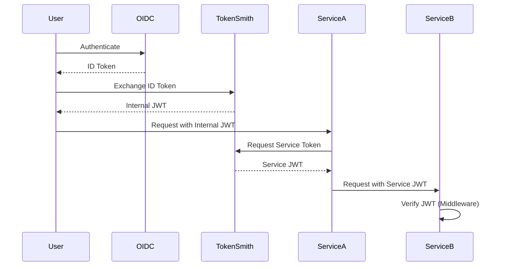

<!--
Copyright © 2025 OpenCHAMI a Series of LF Projects, LLC

SPDX-License-Identifier: MIT
-->

# TokenSmith

TokenSmith bridges external OIDC user identity with internal identity and access management using signed JWTs. It issues TokenSmith JWTs for user and service flows and provides AuthN/AuthZ middleware for validating those tokens and enforcing policy.

## Badges

[](https://api.reuse.software/info/github.com/OpenCHAMI/tokensmith)[](https://github.com/OpenCHAMI/tokensmith/actions/workflows/golangci-lint.yaml)
[](https://github.com/OpenCHAMI/tokensmith/actions/workflows/Release.yaml)
[](https://github.com/OpenCHAMI/tokensmith/releases)
[](https://pkg.go.dev/github.com/OpenCHAMI/tokensmith)
[](https://goreportcard.com/report/github.com/OpenCHAMI/tokensmith)
[](https://securityscorecards.dev/viewer/?uri=github.com/OpenCHAMI/tokensmith)

## Token Flow


```mermaid
sequenceDiagram
    participant User
    participant OIDC
    participant TokenSmith
    participant ServiceA
    participant ServiceB

    %% User Authentication Flow
    User->>OIDC: Authenticate
    OIDC-->>User: ID Token
    User->>TokenSmith: Exchange ID Token
    TokenSmith-->>User: Internal JWT
    User->>ServiceA: Request with Internal JWT

    %% Service-to-Service Flow
    ServiceA->>TokenSmith: Request Service Token
    TokenSmith-->>ServiceA: Service JWT
    ServiceA->>ServiceB: Request with Service JWT
    ServiceB->>ServiceB: Verify JWT (Middleware)
```

## Start Here

TokenSmith provides token exchange plus Casbin-first AuthN/AuthZ middleware.

**First time users:**
- [Quick navigation: Which path applies to me?](docs/getting-started.md#which-path-applies-to-me)
- [Token flows guide: Understand upstream OIDC vs local tokens](docs/token-flows.md)
- [Troubleshooting guide: Diagnose common issues](docs/troubleshooting.md)

**Core documentation:**
- Setup and integration: [`docs/getting-started.md`](docs/getting-started.md)
- HTTP endpoints and wire formats: [`docs/http-endpoints.md`](docs/http-endpoints.md)
- Internal-only service-to-service quick guide: [`docs/internal-service-auth.md`](docs/internal-service-auth.md)
- Middleware wiring and principal context: [`docs/context-guide.md`](docs/context-guide.md)
- Casbin model and policy workflow: [`docs/casbin-first-guide.md`](docs/casbin-first-guide.md)
- Policy loading and `policy_version`: [`docs/authz_policy.md`](docs/authz_policy.md)
- Operations and rollout modes: [`docs/authz_operations.md`](docs/authz_operations.md)
- Fabrica integration: [`docs/fabrica.md`](docs/fabrica.md)
- Claims reference: [`docs/claim-reference.md`](docs/claim-reference.md)
- CLI reference: [`docs/cli-reference.md`](docs/cli-reference.md)
- Security notes: [`docs/security-notes.md`](docs/security-notes.md)

## Features

- **Identity Bridging**
  - Exchange external OIDC tokens for internal JWTs
  - Map external identities to internal service identities
  - Dynamic authorization and scope management via policy engines
  - Single upstream OIDC provider at runtime (configurable without restart)
  - Compatible with multiple OIDC providers (Keycloak, Hydra, Authelia, Azure AD, etc.)

- **Service-to-Service Authentication**
  - Secure internal service communication
  - PKI-based JWT signing and verification
  - Service-specific claims and scopes
  - Automatic token validation

- **AuthN/AuthZ Middleware**
  - TokenSmith JWT validation in `pkg/authn`
  - PKI-based signature validation with RSA, ECDSA, and JWKS key support
  - RFC 7638-compliant `kid` thumbprints for signing keys
  - Middleware enforcement of `kid` presence and RFC 7638 format
  - Principal extraction from verified TokenSmith claims
  - Structured authentication failure logging
  - Casbin-based authorization in `pkg/authz`
  - Service-to-service authorization using TokenSmith service principals

- **OIDC Provider Flexibility**
  - Runtime reconfiguration without restart (no downtime)
  - Provider validation and dry-run mode
  - Support for Keycloak, Hydra, Authelia, Azure AD, and other OIDC-compliant providers
  - Extensible provider interface

- **Break-Glass Access**
  - Local user token minting for emergency scenarios (when upstream OIDC is unavailable)
  - Explicit enable flag to prevent accidental use
  - Audit trail for break-glass token creation

## Quick Start

Generate a default config and run the service:

```bash
tokensmith generate-config --config ./config.json
tokensmith serve \
  --config ./config.json \
  --key-dir ./keys \
  --oidc-issuer https://issuer.example \
  --rfc8693-bootstrap-store ./data/bootstrap-tokens \
  --rfc8693-refresh-store ./data/refresh-tokens
```

Useful first endpoints:

- `GET /health`
- `GET /.well-known/jwks.json`
- `POST /oauth/token`

For complete startup options and environment variable precedence:

- CLI reference: [`docs/cli-reference.md`](docs/cli-reference.md)
- Environment reference: [`docs/env-reference.md`](docs/env-reference.md)
- HTTP endpoints: [`docs/http-endpoints.md`](docs/http-endpoints.md)

### OpenCHAMI Bootstrap-First Quick Start (RFC 8693)

For most OpenCHAMI setups, start with the internal service bootstrap flow:

1. Start TokenSmith with durable bootstrap/refresh stores.
2. Mint an opaque bootstrap token with `tokensmith bootstrap-token create` using the same bootstrap store path.
3. Inject `TOKENSMITH_BOOTSTRAP_TOKEN` into the caller service.
4. Exchange at `POST /oauth/token` and verify `access_token` + `refresh_token` are returned.

Important:

- Bootstrap token issuance is strictly local to the TokenSmith runtime context.
- For Podman Quadlets (common deployment), use `podman exec` into the TokenSmith container when minting bootstrap tokens.

See full guide: [`docs/internal-service-auth.md`](docs/internal-service-auth.md)

## Project Structure

```text
tokensmith/
├── cmd/
│   └── tokenservice/         # CLI entrypoint (`tokensmith`)
├── pkg/
│   ├── keys/               # Key management utilities
│   ├── authn/              # JWT validation + principal mapping middleware
│   ├── authz/              # Casbin-first authorization contract + middleware
│   ├── token/              # JWT token management
│   ├── tokenservice/       # Token exchange service
│   └── testutil/           # Public testing helpers for downstream services
├── docs/                   # AuthZ contract and operations docs
├── examples/
│   └── minisvc/            # AuthN/AuthZ integration example
└── tests/
    └── integration/         # End-to-end integration setup
```

## Local Installation

### Main Service

```bash
go get github.com/openchami/tokensmith
```

### AuthN/AuthZ Middleware

Use the main module and wire TokenSmith JWT validation with `pkg/authn` plus authorization with `pkg/authz`.

```bash
go get github.com/openchami/tokensmith
```

See [`docs/getting-started.md`](docs/getting-started.md) for the recommended middleware stack.

## Testing (local developer guidance)

Recommended local verification (CI may not run all of these):

```sh
go test ./...
go test -race ./...
go vet ./...
```

## Authorization (Casbin-first)

TokenSmith AuthZ is **Casbin-first**: `model.conf` + `policy.csv` + `grouping.csv` are the external interface.

Start here:

- Casbin-first guide: [`docs/casbin-first-guide.md`](docs/casbin-first-guide.md)

Normative (frozen) wire behavior:

- [`docs/authz-spec.md`](docs/authz-spec.md)

Additional normative contract text:

- [`docs/authz_contract.md`](docs/authz_contract.md)

Operational policy loading details:

- [`docs/authz_policy.md`](docs/authz_policy.md)
- [`docs/authz_operations.md`](docs/authz_operations.md)

Diagnostics endpoint and startup logging guidance:

- [`docs/authz_operations.md#diagnostics-endpoint-recommended`](docs/authz_operations.md#diagnostics-endpoint-recommended)

Security/threat model notes:

- [`docs/security-notes.md`](docs/security-notes.md)

Fabrica integration guidance:

- [`docs/fabrica.md`](docs/fabrica.md)

### Embedded baseline policy

TokenSmith embeds a baseline Casbin model + policy that implements the minimum OpenCHAMI RBAC roles:

- `admin`: full CRUD on all resources across all services
- `operator`: read/write on boot + metadata + SMD state; **no delete**
- `viewer`: read-only access to all resources
- `service`: service-to-service calls (e.g., boot-service reading metadata)

Services can run with only the embedded baseline policy, or extend it with filesystem policy fragments.

### Policy lifecycle

- Policies are loaded at **process startup**.
- **No hot reload** in v1: changing policy fragments requires a **restart**.

### Modes (off → shadow → enforce)

Services SHOULD roll out authorization in stages:

1. **off**: authorization disabled
2. **shadow**: evaluate and emit metrics/logs, but do not block requests
3. **enforce**: block denied requests (HTTP 403 with the TokenSmith error body)

### Observability: policy version hash

TokenSmith computes a deterministic policy hash (`policy_version`) for the effective policy set.

Operators should confirm `policy_version` in:

- service startup logs (policy load)
- AuthZ decision logs/metrics (shadow/enforce)
- the 403 JSON error body returned by the AuthZ middleware in `enforce` mode

This makes it possible to confirm exactly which policy is in effect across a fleet.

### Troubleshooting checklist

- If you changed policy fragments but behavior did not change: you likely need a **restart** (no hot reload).
- Compare `policy_version` across pods to ensure the same policy is mounted everywhere.
- In shadow mode, look for *shadow denials* in AuthZ decision metrics/logs to identify what will break when switching to enforce.

## Test utilities (for downstream integration tests)

TokenSmith exposes a small public `pkg/testutil` package intended for **service integration tests**.

Stability policy:

- Best-effort stability within a major version of TokenSmith.
- No guarantees are made about internal structures or unexported behavior.
- Do not use these helpers in production code.

## CLI and Configuration

- CLI commands and flags: [`docs/cli-reference.md`](docs/cli-reference.md)
- Environment variables: [`docs/env-reference.md`](docs/env-reference.md)
- Config schema (`groupScopes`): [`docs/cli-reference.md`](docs/cli-reference.md#configuration-file-schema)

## Development

### Prerequisites

- Go 1.21 or later
- Access to an OIDC provider (Keycloak, Hydra, or Authelia)

### Build & Install

This project uses [GoReleaser](https://goreleaser.com/) to automate releases and embed additional build metadata (commit info, build time, versioning, etc.).

#### 1. Environment Variables

Before building, make sure to set the following environment variables to include detailed build metadata:

- **GIT_STATE**: Indicates whether there are uncommitted changes. (`clean` if no changes, `dirty` if there are.)
- **BUILD_HOST**: Hostname of the machine performing the build.
- **GO_VERSION**: The version of Go used.
- **BUILD_USER**: The username of the person or system performing the build.

Example:

```bash
export GIT_STATE=$(if git diff-index --quiet HEAD --; then echo 'clean'; else echo 'dirty'; fi)
export BUILD_HOST=$(hostname)
export GO_VERSION=$(go version | awk '{print $3}')
export BUILD_USER=$(whoami)
```

#### 2. Installing GoReleaser

Follow the official [GoReleaser installation instructions](https://goreleaser.com/install/) to set up GoReleaser locally.

#### 3. Building Locally with GoReleaser

Use snapshot mode to build locally without releasing:

```bash
goreleaser release --snapshot --clean
```

- The build artifacts (including embedded metadata) will be placed in the `dist/` directory.
- Inspect the resulting binaries to ensure the metadata was correctly embedded.

### Testing

```bash
# Run all tests
go test ./...

# Run specific package tests
go test ./pkg/tokenservice
go test ./pkg/authn
go test ./pkg/authz
```

## Contributing

1. Fork the repository
2. Create your feature branch (`git checkout -b feature/amazing-feature`)
3. Commit your changes (`git commit -m 'Add some amazing feature'`)
4. Push to the branch (`git push origin feature/amazing-feature`)
5. Open a Pull Request

See the [OpenCHAMI Contributors Guide](https://github.com/OpenCHAMI/.github/blob/main/CONTRIBUTING.md) for more information.

## License

This project is licensed under the MIT License - see the LICENSE file for details.

## Acknowledgments

- OpenCHAMI community
- OIDC provider maintainers
- Contributors and maintainers of this project
